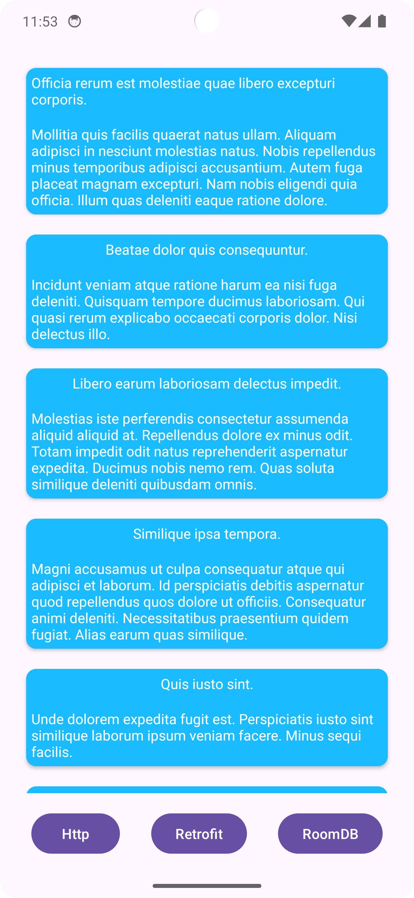

# Workshop Notes

## Step 1: Project Setup

Installed the required dependencies: `room` and `retrofit` to `build.gradle.kts`.

## Step 2: Database with Room

Created the `Note.kt` data class with RoomDB's annotations and `NoteDao` to provide an interface for operations on this model.

Also created the `AppDatabase` class Database Provider.

## Step 3: HTTP Calls with `HttpURLConnection` and `Retrofit`

Implemented network requests with both `HttpURLConnection` and `Retrofit` while utilizing Kotlin coroutines to prevent UI blocking.
All the classes implement the `NotesRepository` which provides asynchronous functions using the `suspend` keyword so they can be used inside coroutines in the `MainActivity`.
Also used [https://mockapi.io](https://mockapi.io) to provide a Mock API so we can fetch the notes from the app.

## Step 4: Repository Layer

To make it easier for interchanging the data source, I implemented a `NotesRepository` layer which provides an interface for accessing `Note`s regardless of the data source.

## Step 5: Basic Activity to Experiment

Created a RecyclerView with some buttons to request data from the different sources: RoomDB, network with `Retrofit` and `HttpURLConnection.

# Screenshots

